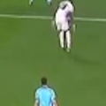

# Frame-Interpolation
> Motion Compensated Frame Interpolation using Deep ConvNets

## About

Frame Interpolation is the technique of generating intermediate frames between existing ones, by the method of interpolation, such that the resulting frame sequence may be smoother and more continuous.
Interpolation can be achieved by a number of methods, averaging being the simplest of the lot. This repository tries to illustrate the process of interpolation by making use of deep convolutional neural networks.

## Usage

First of all, install all the required libraries with the help of the following command

    pip3 install -r requirements.txt

To explore some code, run any of the notebooks in the `Clips`, `Model` or `Dataset` directories. 
Next, to see some examples of interpolation, view any pair of corresponding clips present within the `Examples` directory.

To interpolate any of your own clips, run the following command

    python3 fps.py [filepath] -u [interpolation factor]
    
where *filepath* is the path to the clip you want to interpolate, and *interpolation factor* is an integer multiplier

You can also downscale the frame rate of any of your clips by using the command

    python3 fps.py [filepath] -d [reduction factor]

## Demo

Instead of training the model on entire frames, useful windows across frame triplets have been captured and used for training. These windows are smaller than the actual frames, and are used for reducing training time, and reducing data redundancy. An example is provided below:

The first frame.

The second frame.

The predicted middle frame.

The predicted middle frame.

As you can probabably observe, the model learns to selectively spread out the legs of the player within the intermediate frame, such that the degree of the spread is an intermediate of that shown in the first and the second frame. 

A fair criticism of the model would be that it loses the definition of edges in the frame it generates.
